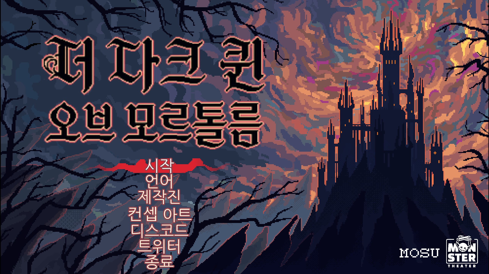
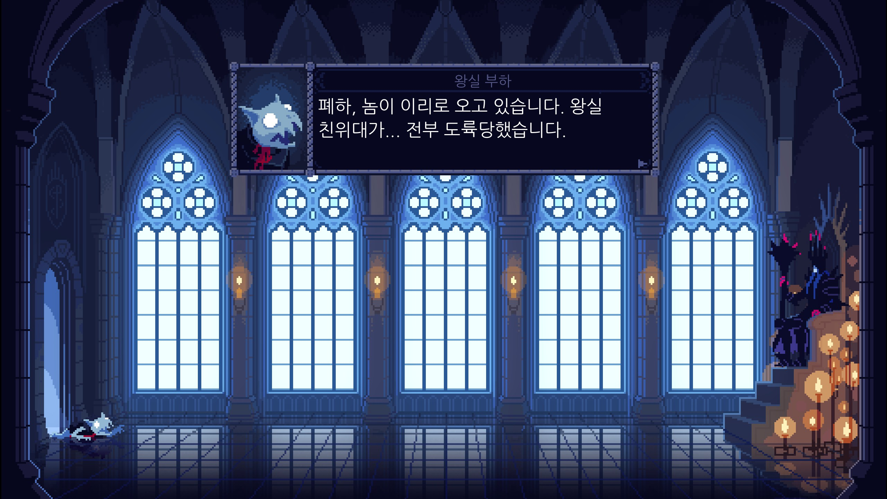

# The Dark Queen of Mortholme 한국어 패치 v1.0

> 공식 한국어를 지원하지 않는 The Dark Queen of Mortholme의 비공식 한국어 패치입니다.

---

## 스크린샷

| | |
|---|---|
|  |  |

---

## 번역 범위

| 분류 | 내용 | 상태 |
|------|------|------|
| 대사 | 여왕, 영웅, 왕실 부하 등 전체 대사 | 완료 |
| UI / 메뉴 | 메인 메뉴, 설정, 선택지, 이름표 | 완료 |
| 이미지 UI | 보스 이름표 한국어화 | 완료 |
| 기타 | 용어 통일, 말투 감수, 인게임 오탈자 점검 | 완료 |

### 주요 작업 내용

- 화자 재분류 및 오분류 정리
- 여왕 / 영웅 말투 전면 감수
- 선택지 연계 대사 구조 정리
- 인게임 길이 초과 문장 축약
- 보스 이름표 이미지 한국어화

---

## 다운로드

- [GitHub Releases](https://github.com/hanpaemo/the-dark-queen-of-mortholme-korean-patch/releases)
- 권장 파일: `TheDarkQueenofMortholme_KoreanPatch_v1.0.zip`

---

## 설치 방법

1. [Releases](https://github.com/hanpaemo/the-dark-queen-of-mortholme-korean-patch/releases)에서 최신 ZIP 파일을 다운로드합니다.
2. 압축을 해제합니다.
3. 게임 설치 폴더를 엽니다.

```text
기본 경로:
D:\SteamLibrary\steamapps\common\The Dark Queen of Mortholme\The Dark Queen of Mortholme Windows
```

4. 기존 `The Dark Queen of Mortholme.exe`를 백업합니다.
5. 압축에 들어 있는 `The Dark Queen of Mortholme.exe`를 위 폴더에 덮어씁니다.
6. 게임을 실행합니다.

---

## 제거 방법

- 백업해 둔 원본 `The Dark Queen of Mortholme.exe`로 되돌리면 됩니다.

---

## 주의사항

- Steam Windows 버전 기준입니다.
- 게임 업데이트 후에는 실행 파일이 원본으로 바뀔 수 있으므로 패치를 다시 적용해야 할 수 있습니다.
- 작은 프롬프트 UI 일부는 원문 스타일 유지를 위해 영어 이미지를 그대로 사용했습니다.

---

## 기술 정보

- 엔진: Godot 4.2.2
- 패치 방식: 실행 파일 내부 `GDPC` PCK의 번역 리소스 교체
- 반영 리소스:
  - `res://Translations/dialogue.en.translation`
  - `res://Translations/menu.en.translation`
  - `res://Translations/character_names.en.translation`
- 추가 이미지 교체:
  - `res://.godot/imported/bosstitle.png-9ef0f917bcce15aabe8659f6ec3cd7a4.ctex`

---

## 변경 이력

### v1.0

- 첫 공개 배포
- 전체 대사, 메뉴, 화자명 한국어화
- 여왕 / 영웅 말투 및 감정선 전면 감수
- 보스 이름표 한국어 이미지 반영
- 인게임 기준 줄바꿈, 길이, 선택지 흐름 최종 점검

---

## 오류 제보 / 기여

- [GitHub Issues](https://github.com/hanpaemo/the-dark-queen-of-mortholme-korean-patch/issues)
- 블로그 댓글: https://hanpaemo.blogspot.com

---

## 후원

- Ko-fi: https://ko-fi.com/hanpaemo

---

## 한패모

- GitHub: https://github.com/hanpaemo
- 블로그: https://hanpaemo.blogspot.com

---

## 라이선스

이 패치는 무료 비공식 번역입니다.
게임 원작의 저작권은 개발사에 있으며, 상업적 이용은 금지합니다.
